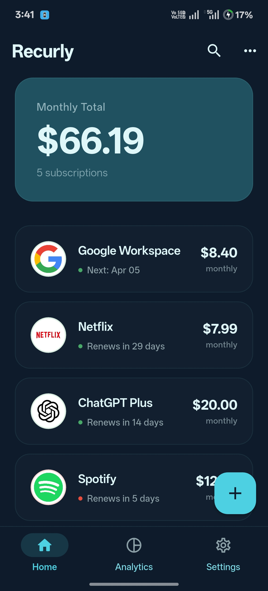
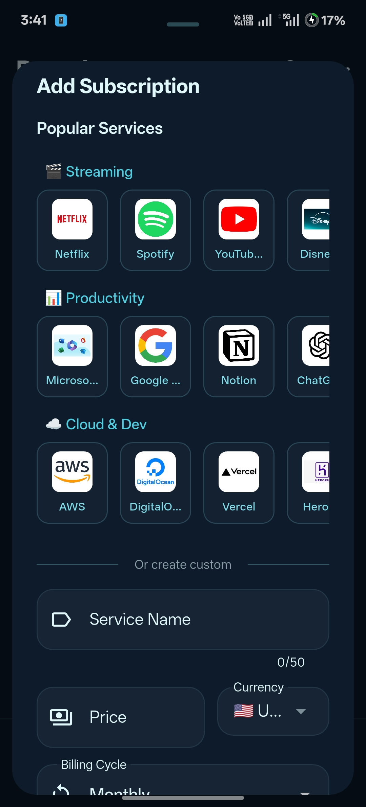
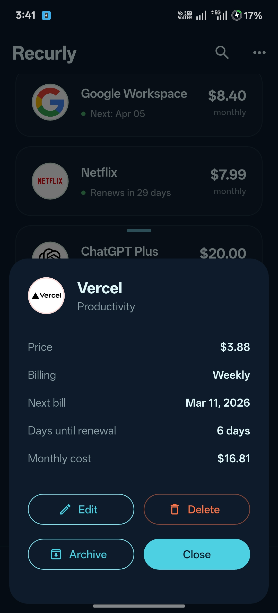
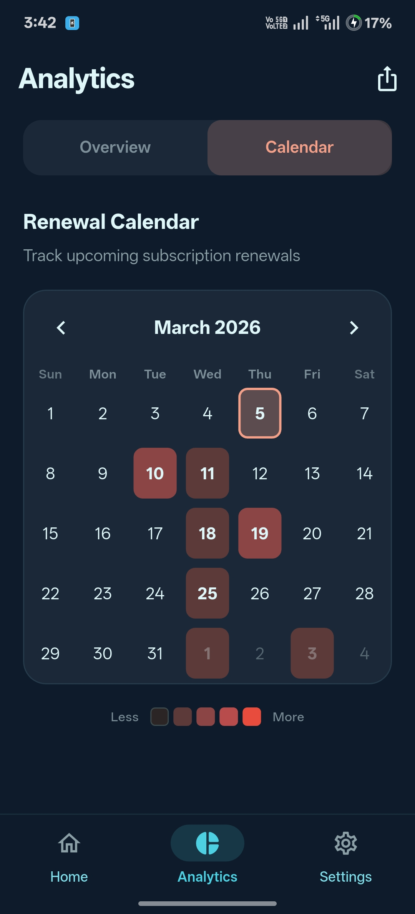
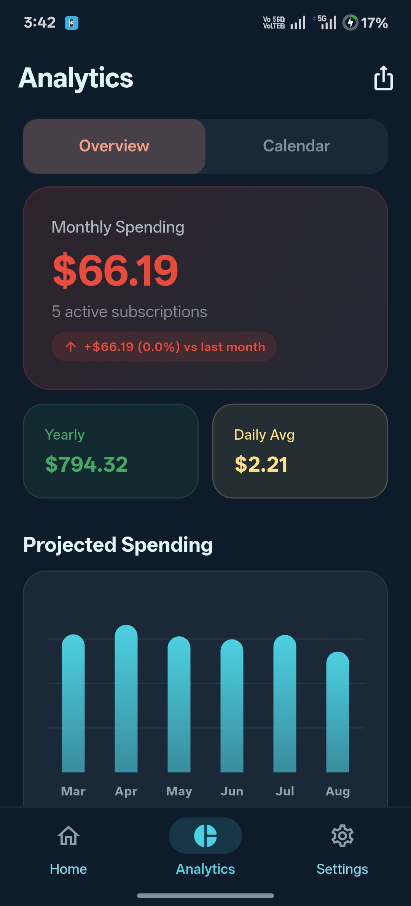
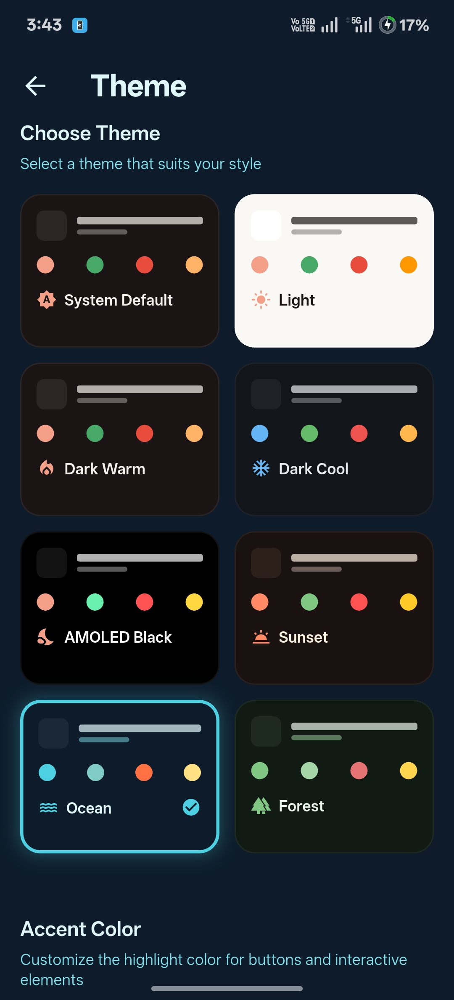

# Recurly

> Subscription tracker with Material You design for Android.


Track every subscription you pay for — renewals, costs, budgets, and shared expenses — all in one place, with or without an account.

---

## Screenshots

| Home | Add Subscription | Details |
|------|-----------------|---------|
|  |  |  |

| Calendar | Analytics | Themes |
|----------|-----------|--------|
|  |  |  |

---

## Features

### Core
- Add and track subscriptions with automatic renewal dates
- Subscription logos, custom categories, and icon picker
- Archive subscriptions and restore recently deleted (30-day window)
- Calendar view of all upcoming renewals

### Spending & Analytics
- Monthly and yearly spend totals on the dashboard
- Analytics screen — spending trends, category breakdown, renewal forecast
- Price history tracking — see how a subscription's cost has changed over time
- Cancel simulator — see how much you'd save cancelling any subscription
- Budget gauge — set a monthly limit and track against it

### Multi-currency
- Live exchange rates fetched automatically
- Per-subscription currency, displayed in your preferred currency
- Auto-detects primary currency from your subscriptions

### Household & Splitting
- Link with a partner and see each other's subscriptions
- Split any subscription with a configurable share percentage
- Household total that avoids double-counting shared costs

### Notifications & Widgets
- Renewal reminders 1, 3, and 7 days before billing
- Configurable notification time
- Home screen widget showing monthly spend and upcoming renewals

### Free Trial Tracking
- Mark subscriptions as free trials with an end date
- Countdown badge on card and details sheet
- Price-after-trial displayed so you know what's coming

### Sync & Privacy
- Offline-first — all features work without an account
- Optional Google Sign-In with Firestore cloud sync
- Data stays on-device by default; sync is opt-in

---

## Tech Stack

| Layer | Technology |
|---|---|
| UI | Flutter 3.41 · Material 3 · Dynamic color |
| State | Riverpod |
| Local DB | Hive (offline-first) |
| Cloud | Firebase Auth · Firestore |
| Notifications | flutter_local_notifications |

---

## Getting Started

### Prerequisites
- Flutter 3.41+
- Android device or emulator (Android 8.0+)
- For cloud sync: a Firebase project with `google-services.json`

### Run locally

```bash
# Install dependencies
flutter pub get

# Generate Hive adapters
dart run build_runner build --delete-conflicting-outputs

# Run
flutter run
```

### Build release AAB

```bash
flutter build appbundle --release --no-tree-shake-icons
```

---

## Project Structure

```
lib/
├── models/          # Hive data models
├── providers/       # Riverpod state providers
├── screens/         # Full-page screens
├── widgets/         # Reusable UI components
│   └── analytics/   # Analytics chart widgets
├── services/        # Business logic (sync, notifications, export…)
├── theme/           # App themes and color system
└── main.dart
```

---

## Contributing

Pull requests are welcome. For significant changes, open an issue first to discuss what you'd like to change.

---

## License

[CC BY-NC 4.0](LICENSE) — free for personal and non-commercial use.
